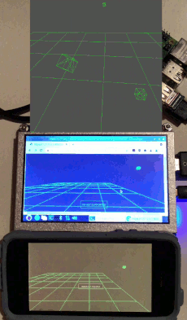

# Threejs-VR-Croquet-Experiment (under construction)

Explore Croquet real-time shared VR experiences with Threejs. 

Oculus Browser (top), Raspberry Pi Chromium, and Safari. Rotating cube at right controller/hand when trigger is pressed. Rotating cube in front z = -4 with left trigger. 

# Hardware

Oculus Quest (tested Quest One, update 35.0, Oculus browser 18.0, work with controllers or hands) 

A Raspberry Pi 4 (or Pi Zero W) for software/hardware development. 

# Experiment 1 

A developer key from Croquet is required to access reflectors on the net. A new key can be generated (old key invalid?). 

A Raspberry Pi is used as a web server on a local area network and is connected to the internet for Croquet reflectors to work. 

Web services (eg. glitch, codepen) is another way to test codes if no Raspberry Pi. However, with free account, code is publicly readable so not sure about invited shared VR experiences. 

Code is minimal (no error checking, no teleportation, no avatars). An experiment to jumpstart other experiments.

<pre>

&lt!DOCTYPE html>
&lthtml lang="en">
  &lthead>
	&ltmeta charset="utf-8">
	&ltscript src="https://unpkg.com/@croquet/croquet">&lt/script>
  &lt/head>

  &ltstyle>
	body { margin: 0; }
	canvas { width: 100%; height: 100% }
  &lt/style>

  &ltbody>

&ltcanvas id="three" touch-action="none"></canvas>

&ltscript type="module">

import * as THREE from 'https://threejs.org/build/three.module.js';
import { OrbitControls } from 'https://threejs.org/examples/jsm/controls/OrbitControls.js';
import {VRButton} from 'https://threejs.org/examples/jsm/webxr/VRButton.js';

var controller1, controller2, geometry, green1, green, controls;

var newx = 0;
var newy = 0;
var newz = 0;

class MyModel extends Croquet.Model {

  init(options) {
    
    super.init(options);

    this.count = 0.0;

    this.BoxPos = [0, 0, -4];

    this.subscribe(this.id, "box-position", this.BoxPosition);

    this.future(100).tick();

  }

BoxPosition(pos) {

    this.BoxPos = pos;
    this.publish(this.id, "box-pos-changed", pos);

  }

tick() {

    this.count += 0.1;		// count animates a rotating cube, or a mass-on-a-spring simulation
        
    this.publish("box","update",this.count);
        
    this.future(100).tick();

    }

}

MyModel.register("MyModel");

function setUpScene() {

	const scene = new THREE.Scene();
	scene.background = new THREE.Color(0x505050);

	const camera = new THREE.PerspectiveCamera(75,window.innerWidth / window.innerHeight,0.1,1000);
	window.camera = camera;
	camera.position.set(0,1.0,2);

	const threeCanvas = document.getElementById("three");

	const renderer = new THREE.WebGLRenderer({ canvas: threeCanvas, antialias: true }); 
	window.renderer = renderer;

	controls = new OrbitControls(camera, renderer.domElement);

// Add a floor

	var color = new THREE.Color(0x00ff00);
	var floor = new THREE.GridHelper(8,8,color,color);
	scene.add(floor);

function onWindowResize() {

	camera.aspect = window.innerWidth / window.innerHeight;
	camera.updateProjectionMatrix();
	renderer.setSize(window.innerWidth, window.innerHeight);

	}

	window.addEventListener("resize", onWindowResize, false);
	onWindowResize();

	controller1 = renderer.xr.getController(0);
	scene.add( controller1 );

	controller2 = renderer.xr.getController(1);
	scene.add( controller2 );

	geometry = new THREE.BoxBufferGeometry(0.05,0.05,0.05);

	green = new THREE.Mesh(geometry, new THREE.MeshBasicMaterial({color: 0x00ff00}));
	green.material.wireframe = true;

	green1 = new THREE.Mesh(geometry, new THREE.MeshBasicMaterial({color: 0x00ff00}));
	green1.material.wireframe = true;

	controller1.add(green);
	controller2.add(green1);
  
function onSelectStart() {

	this.userData.isSelecting = true;

	}

function onSelectEnd() {

	this.userData.isSelecting = false;

	}

	controller1 = renderer.xr.getController(0);
	controller1.addEventListener( 'selectstart', onSelectStart );
	controller1.addEventListener( 'selectend', onSelectEnd );
	scene.add( controller1 );

	controller2 = renderer.xr.getController(1);
	controller2.addEventListener( 'selectstart', onSelectStart );
	controller2.addEventListener( 'selectend', onSelectEnd );
	scene.add( controller2 );
  
function sceneRender() {

	renderer.render(scene, camera);

	}

  return { scene, sceneRender };

}

class MyView extends Croquet.View {

	constructor(model) {

	super(model);

	this.sceneModel = model;
	const sceneSpec = setUpScene();

	this.scene = sceneSpec.scene;
	window.scene = this.scene;
	this.sceneRender = sceneSpec.sceneRender;

	this.box = new THREE.Mesh(
	new THREE.BoxBufferGeometry(0.1,0.1,0.1),
	new THREE.MeshBasicMaterial({color: 0x00ff00}));
	this.box.material.wireframe = true;
	this.scene.add(this.box);

	this.box.position.fromArray(model.BoxPos);
	this.scene.add(this.box);

	this.subscribe(model.id, "box-pos-changed", this.moveBox);
    
	this.subscribe("box", "update", this.rotate);

	}

moveBox(pos) {

	this.box.position.fromArray(pos);

	}

rotate(data) {

	this.box.rotation.x = data;
	this.box.rotation.y = data;

	}

update(time) {

	if (controller1.userData.isSelecting) {

		newx = controller1.position.x;
		newy = controller1.position.y;
		newz = controller1.position.z;
		this.publish(this.sceneModel.id, "box-position", [newx,newy,newz]);

	}

	if (controller2.userData.isSelecting) {

		newx = controller2.position.x;
		newy = controller2.position.y;
		newz = -4; //controller2.position.z;
		this.publish(this.sceneModel.id, "box-position", [newx,newy,newz]);

	}

	this.sceneRender();
    
	}

}

Croquet.Session.join({

	appId: "com.example.myapp",   // namespace for session
	apiKey: "your_api_key",       // sign up for a key from Croquet
	name: "unnamed",	      // Croquet tutorials "unnamed"
	password: "secret",	      // Croquet tutorials "secret"
	model: MyModel,
	view: MyView,
	step: "manual",
	}).then(session => {
	window.session = session;

	document.body.appendChild(VRButton.createButton(renderer));
	renderer.xr.enabled = true;
	renderer.setAnimationLoop(function() {
	controls.update();
	renderer.render(scene, camera);
	if (window.session && window.session.view) {
	window.session.step();
	}
  });
});

    &lt/script>
  &lt/body>
&lt/html>

</pre>

# Credits

https://www.croquet.io/

https://threejs.org/

# References

https://threejs.org/docs/manual/en/introduction/How-to-create-VR-content.html

Tutorials "Hello World" and "3D Animation" were used to develop Experiment 1. 

https://croquet.io/docs/croquet/

https://www.youtube.com/watch?v=Nu2Siz_rjTg

Croquet history. 

https://www.youtube.com/watch?v=cXGLOiZUZ2U
